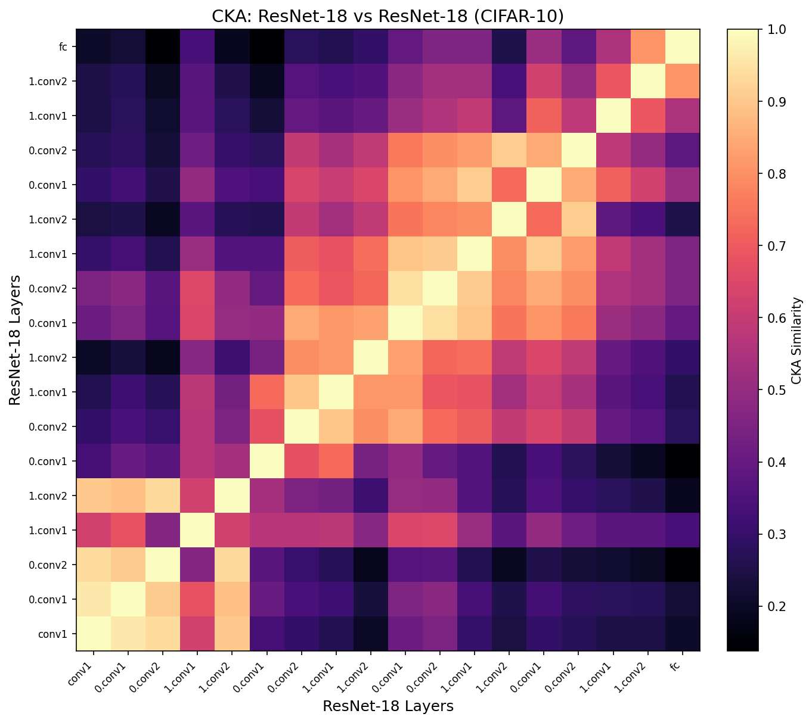

import { PublicationLinks } from "@/components/items";

## Project Overview

**pytorch-cka** is a PyTorch library for measuring how similar the internal
representations of neural networks are, using Centered Kernel Alignment (CKA) — the
metric introduced by Kornblith et al. (ICML 2019). CKA compares the activations two
layers produce over the same inputs, so it can answer how alike two models, or two
layers within a model, really are — a common need when studying transfer, fine-tuning,
and representational drift.

The library is built for doing this at scale. Vectorized operations and GPU
acceleration compute CKA across all 18 representational layers of ResNet-18 on CIFAR-10
up to **44× faster** than existing implementations on an NVIDIA H100, while explicit
memory deallocation keeps large layer-by-layer comparisons within budget. It works with
HuggingFace models, `DataParallel`, and DDP, and ships heatmap and line-chart
visualizations for reading the results.

Published on PyPI as [`pytorch-cka`](https://pypi.org/project/pytorch-cka/), it has
surpassed **5K downloads**.

<PublicationLinks
  url={{
    git: "https://github.com/ryusudol/Centered-Kernel-Alignment",
    web: "https://pypi.org/project/pytorch-cka/",
  }}
/>
