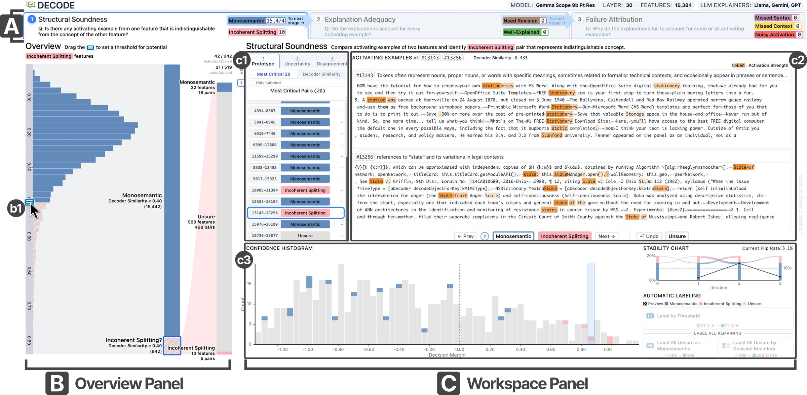

## Overview

DECODE is a visual analytics system for diagnosing failures in LLM-based automated
interpretation workflows. Its three-stage interface isolates structural,
explanation, and attribution failures, while consensus signals and active seeding
prioritize cases for human review.
