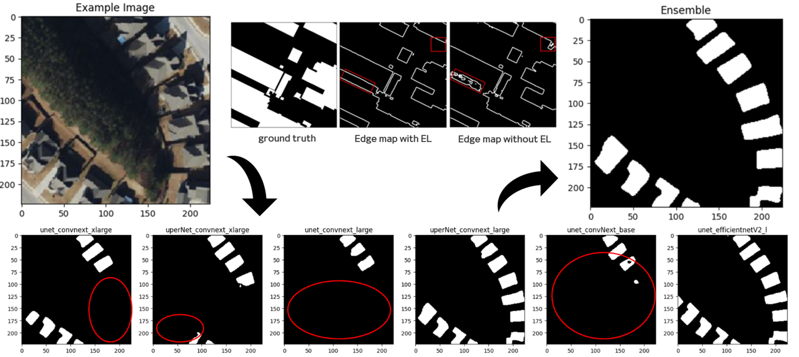

import { PublicationLinks } from "@/components/items";

## Project Overview

Built a building-footprint segmentation pipeline for satellite imagery using
tailored preprocessing, Elastic Transform and Random Shadow augmentation, and an
ensemble of six ConvNeXt- and EfficientNet-based models. The project ranked 2nd
among approximately 1,000 participants and received the IITP Director's Award.

<PublicationLinks
  url={{ git: "https://github.com/gnueaj/Satellite-Image-Building-Area-Segmentation" }}
/>
