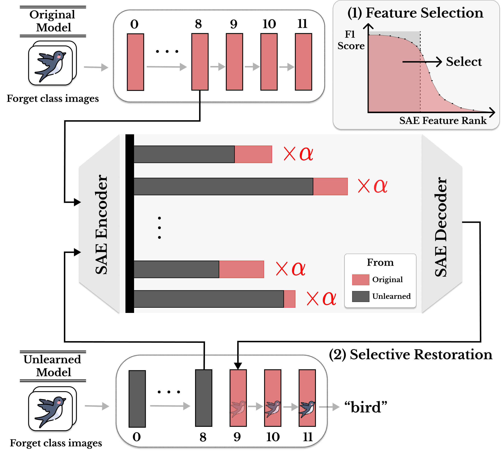

## Abstract

This work presents a restoration-based analysis framework for determining whether
machine unlearning deletes information or merely suppresses it at the decision
boundary. The framework uses sparse autoencoders to identify class-specific expert
features in intermediate layers, then applies inference-time steering to test whether
unlearned information can be restored. Its analysis of 12 image-classification
unlearning methods shows that representation-level retention can remain hidden from
output-based evaluation.
