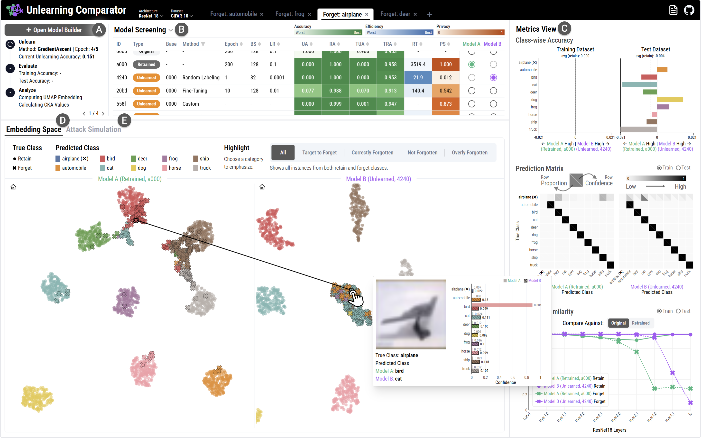

## Abstract

Machine Unlearning (MU) aims to remove target training data from a trained model so
that the removed data no longer influences the model's behavior, fulfilling "right to
be forgotten" obligations under data privacy laws. Yet, we observe that researchers in
this rapidly emerging field face challenges in analyzing and understanding the
behavior of different MU methods, especially in terms of three fundamental principles
in MU: accuracy, efficiency, and privacy. Consequently, they often rely on aggregate
metrics and ad-hoc evaluations, making it difficult to accurately assess the
trade-offs between methods. To fill this gap, we introduce a visual analytics system,
Unlearning Comparator, designed to facilitate the systematic evaluation of MU methods.
Our system supports two important tasks in the evaluation process: model comparison
and attack simulation. First, it allows the user to compare the behaviors of two
models, such as a model generated by a certain method and a retrained baseline, at
class-, instance-, and layer-levels to better understand the changes made after
unlearning. Second, our system simulates membership inference attacks (MIAs) to
evaluate the privacy of a method, where an attacker attempts to determine whether
specific data samples were part of the original training set. We evaluate our system
through a case study visually analyzing prominent MU methods and demonstrate that it
helps the user not only understand model behaviors but also gain insights that can
inform the improvement of MU methods.
