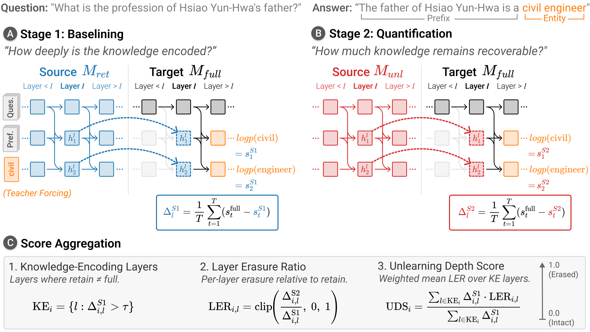

## Abstract

Large language model (LLM) unlearning has emerged as a crucial post-hoc mechanism for
privacy protection and AI safety, yet auditing whether target knowledge is truly
erased remains challenging. Existing output-level metrics fail to detect when this
knowledge remains recoverable from internal representations. Recent white-box studies
reveal such residual knowledge but often rely on auxiliary training or
dataset-specific adaptations, leaving no generalizable metric. To address these
limitations, we propose the Unlearning Depth Score (UDS), a metric that quantifies the
mechanistic depth of unlearning via activation patching. UDS first identifies layers
that encode the target knowledge using a retain model baseline, then measures how much
of it is erased in the unlearned model on a 0-1 scale. In a meta-evaluation across 20
metrics on 150 unlearned models spanning 8 methods, UDS achieves the highest
faithfulness and robustness, confirming our causal approach as the most reliable for
unlearning evaluation. Case studies further reveal that white-box metrics can disagree
at the layer level and that erasure depth varies across examples. We provide
guidelines for integrating UDS into existing benchmarking frameworks and streamlining
the evaluation pipeline.
